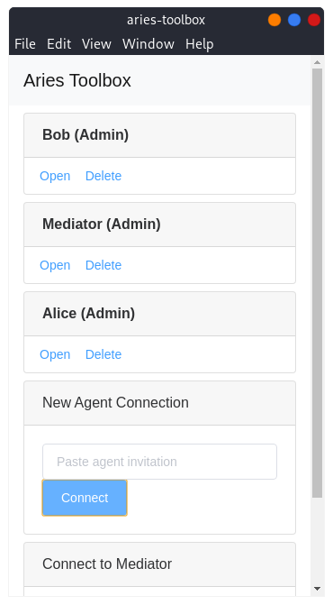
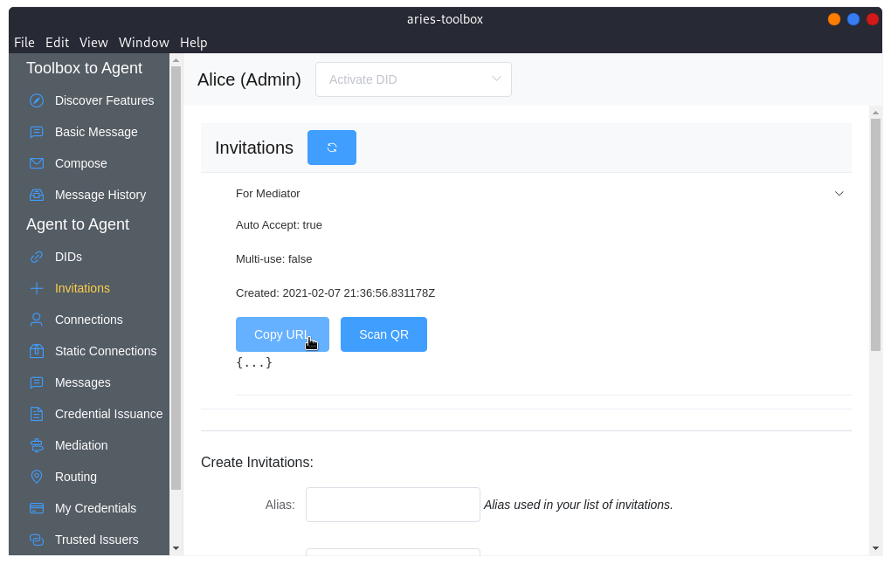

# Indicio Mediator Training - Lab 1

In this lab, we will be demonstrating mediation using three local agents: Alice,
Bob, and a Mediator. We will connect Alice and the Mediator, arrange for
mediation, and connect Alice and Bob through the Mediator.

## Setup

### Prerequisites
Before we get started, we will need to download and install the following:

- [Docker](https://docs.docker.com/)
- [Docker Compose](https://docs.docker.com/compose/install/)
- [Node JS](https://nodejs.org/en/download/) - Current LTS Release

### Obtain Code

#### Aries Toolbox

```shell
$ git clone https://github.com/hyperledger/aries-toolbox
```

#### Lab Agent Configuration
```shell
$ git clone https://github.com/indicio-tech/mediator-labs
```

### Start up the Toolbox

We will start by installing the Aries Toolbox and its dependencies and starting
up an instance.

First, enter the toolbox directory:
```shell
$ cd aries-toolbox
```

Now, install dependencies:
```shell
$ npm install
```

Finally, start the toolbox with:
```shell
$ npm run dev
```

A window like the following should pop up:


### Start the Lab Agents

Next, we will start the Agents we will be using for this lab.

The lab agents are configured as Docker containers and will be started using
Docker Compose.

First, enter the lab directory:
```shell
$ cd mediator-labs/lab1
```

Then run the compose script:
```shell
$ docker-compose up --build
```

#### Running on Linux

A separate compose script is included for Linux. To run it, use the following:
```shell
$ docker-compose -f docker-compose-linux.yml up --build
```

If you are a RHEL based system, you can also use `podman` directly with the
included `Makefile.podman`. Feel free to explore this file and use it if you are
comfortable but the details of its usage will not be shown here.

#### Output

You should see output from each of the three agents, Alice, Bob, and Mediator,
printed to your terminal, similar to the following:


The text of the output may mingle and may initially be confusing but the lines
we are most interested in are those containing an Invitation URL. There will be
one for each of the agents (look for the `bob_1` or `alice_1` at the beginning
of the line to ensure you're looking at the one you intend to).


## Connecting Agents to the Toolbox

### Introduction to the Toolbox

Now that we have started everything up, let's get familiar with the different
pieces of this Lab.

Find one of the Agent invitations printed to the terminal -- this one is for
Bob:


Copy and paste the invitation into the Toolbox window in the **New Agent
Connection** box.


Click **Connect**.

A new box will appear showing your newly formed connection.


Click **Open** on your new connection.


This will open up a window that allows us to control our agent -- in this case,
Bob:


Feel free to click around and explore for a moment. For this Lab, our agents are
not connected to any verifiable data registry so we won't be able to perform any
ledger operations.

The navigation menu options under **Toolbox to Agent** represent interactions
occurring directly between our agent (Bob) and the Toolbox. For instance, the
**Discover Features** section shows us what protocols our Bob agent reported to
the Toolbox.


The navigation menu options under **Agent to Agent** represent interactions
occurring between our agent (Bob) and other agents (Alice, Mediator, etc.). We
can use the toolbox to "remote control" Bob and do things like create new
connections with other agents, send basic messages, coordinate mediation, or
perform various credential and presentation exchange operations (if our agents
were connected to a ledger).

### Connect to the remaining agents

Let's now connect to the remaining two agents.


Copy each remaining Invitation URL from the console, pasting into the **New
Agent Connection** box and pressing connect with each. You may have to scroll up
past new messages in the logs.


Once you have connected to all three, each agent will be present in the list.



## Connect Alice to the Mediator

### Create Connection Invitation

To set up a mediated connection between Alice and Bob, Alice must first connect
to the Mediator. Open the **Alice (Admin)** agent and select **Invitations**
from the navigation menu.


From this view, we will create a new connection invitation that we will then
send to the Mediator.

Enter in a short but informative alias for the invitation (this is the value
that helps distinguish one invitation from another) such as **For Mediator**.

Leave **Label**, **Group**, and **Mediator** empty for now. Make sure **Auto
Accept** is checked and that **Multiuse** is not checked.


Click **Create New Invite**.

The Invitations list above will update with your new invitation.


Expand the invitation list item by clicking anywhere on the row.



Click **Copy URL**. The invitation URL is now in your clipboard ready to be
pasted into the Mediator Agent.

### Accept Invitation from Mediator


From the original toolbox window, click **Open** on the **Mediator (Admin)**
agent. Select **Connections** from the navigation menu.


Paste the contents of your clipboard into the **Invitation URL** text box and
click **+ Add**.


A new connection will briefly appear in the **Pending Connections** list:


The connection will then move from **Pending** to **Active Connections** after
the connection protocols completes.


Alice and the Mediator are now connected!

## Requesting Mediation

The next step before Alice and Bob can have a mediated connection is for Alice
to request mediation from the Mediator. Returning to the **Alice (Admin)** agent
window, select **Routing** from the navigation menu.


Under the **Request Mediation** section, click the **Potential Mediator...**
drop down menu and select **Mediator** (the label of Alice's connection to the
Mediator agent).

> **Note:** If you do not see **Mediator** in the list, try first navigating to
> **Connections** from the navigation menu and ensuring you see the connection
> present there first. Return to the **Routing** view and try selecting
> **Mediator** once more.


Then click **Request**:


After a moment, click the **Refresh** button next to **Mediators**.


We should see that the agent **Mediator** is now listed.


If we expand the list item by clicking anywhere on the row, we see that our
Mediator has granted our mediation request.


> This grant happened automatically for our lab scenario but in the real world,
> mediators will likely be more discerning of who it is willing to grant
> mediation for.

## Creating a new Mediated Connection

### Invitation

Now that we have established a connection with the Mediator and have been
granted mediation, Alice is now ready to start creating a new mediated
connection. Return to the **Invitations** view:


This time, we are creating an invitation for Bob. Fill out an easily
identifiable alias such as "For Bob" and leave **Label** and **Group** empty.

Now, we will select **Mediator** from the **Mediator** drop down menu.
This will inform Alice's agent that the connection created with this invitation
should be mediated through **Mediator**.

Make sure the **Auto-Accept** option is checked.

Click **Create New Invite**.


Expand the **For Bob** invitation by clicking anywhere on the row and click
**Copy URL**.


### Accept Invitation

Next, **Open** the **Bob (Admin)** agent (if you haven't already), and navigate
to **Connections** in the navigation menu.


Paste the contents of the clipboard into the **Invitation URL** and click **+
Add**.


As before, a new connection will briefly show in **Pending Connections**.


Before quickly moving to the **Active Connections** list as the connection
protocol successfully completes.


Congratulations! You have successfully created a mediated connection!

## Is it working?

One interesting characteristic of Mediation is that when everything is working,
it can be difficult to tell if the connection is actually mediated!

We can test out the connection by sending a basic message from Bob to Alice.

From the **Bob (Admin)** agent window, select **Messages** from the navigation
menu.


Select **Alice** from the **To** drop down menu.


And type out a message for Alice in the **Message** box, followed by clicking
**Send**.


To see if Alice got the message, we will go back to the **Alice (Admin)** agent
window and navigate to the **Messages** view. From there, select **Bob** in the
**To** drop down menu.


We should then see Bob's message.


## But is it really mediated?

We have demonstrated that the connection between Alice and Bob is live and
working without issue. We now know that mediation isn't somehow interfering with
the connection but we still haven't seen evidence that mediation is actually
occurring. To dig a little deeper, let's inspect both Alice's and the Mediator's
view of the mediation state.

Still in the **Alice (Admin)** agent window, navigate to the **Routing** view in
the navigation menu.


From this view, we see that a new **Client Route** has appeared. This "route"
represents an item in the Mediator's lookup table that Alice reported during the
connection protocol with Bob.

Return to the **Mediator (Admin)** agent window and navigate to **Mediation** in
the navigation menu.


Here we see a new **Mediated Route** has appeared. This "route" represents the
same key in the Mediator's lookup table that we viewed from Alice's perspective.
With that, we can be relatively confident that messages are flowing through the
mediator to Alice from Bob.
