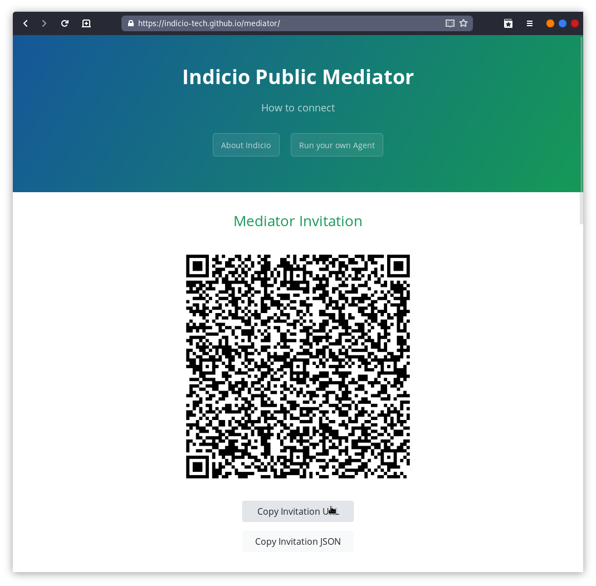

# Indicio Mediator Training - Lab 2

In this lab, we will demonstrate mediation when using a "Mobile" device. For
this lab, the Aries Toolbox will act as stand in mobile device since it operates
the same way as Mobile Agents for message retrieval.

We will use the Toolbox, an ACA-Py Agent representing Alice, and the Indicio
Public Mediator as our mediator.

## Setup

### Prerequisites
Before we get started, we will need to download and install the following:

- [Docker](https://docs.docker.com/)
- [Docker Compose](https://docs.docker.com/compose/install/)
- [Node JS](https://nodejs.org/en/download/) - Current LTS Release

### Obtain Code

Setup for this lab is very similar to our first lab. If you've already cloned
the Toolbox and the lab repo before, you can skip these first couple of steps
but it is a good idea to check for updates with a `git pull`.

#### Aries Toolbox

```shell
$ git clone https://github.com/hyperledger/aries-toolbox
```

#### Lab Agent Configuration
```shell
$ git clone https://github.com/indicio-tech/mediator-labs
```

### Start up the Toolbox

We will start by installing the Aries Toolbox and its dependencies and starting
up an instance.

First, enter the toolbox directory:
```shell
$ cd aries-toolbox
```

Now, install dependencies:
```shell
$ npm install
```

Finally, start the toolbox with:
```shell
$ npm run dev
```

A window like the following should pop up:


### Start the Alice Agent

Next, we will start the Alice Agent that will serve as one actor in our lab.

Alice is configured as a Docker container with some additional infrastructure
around it that will be started using Docker Compose.

First, enter the lab directory:
```shell
$ cd mediator-labs/lab2
```

Then run the compose script:
```shell
$ docker-compose up --build
```

#### Running on Linux

A separate compose script is included for Linux. To run it, use the following:
```shell
$ docker-compose -f docker-compose-linux.yml up --build
```

If you are a RHEL based system, you can also use `podman` directly with the
included `Makefile.podman`. Feel free to explore this file and use it if you are
comfortable but the details of its usage will not be shown here.

#### Output

You should see output for the Alice Agent similar to the following:


## Connect Toolbox to Mediator

Follow this link to the Indicio Public Mediator:
[https://indicio-tech.github.io/mediator/](https://indicio-tech.github.io/mediator/)


Click **Copy Invitation URL**. This will copy a connection invitation from the
mediator to our clipboard.



Next, paste the invitation into the **Connect to Mediator** box in the toolbox
and press **Connect**.


The **Indicio Public Mediator** connection will appear in our agent list and
after a moment **_Mediator_** will appear in the box as well.


This indicates that the Toolbox has connected to the **Indicio Public Mediator**
agent, requested mediation, and received the notification of granted mediation.
The Toolbox is now ready to receive connections through the Mediator.

## Connect Alice and the Toolbox through the Mediator

Now, we need to copy the invitation URL from the **Alice** terminal.


Paste the invitation in the **New Agent Connection** box in the Toolbox agent
list window. Press **Connect**.


The **Alice (Admin)** agent will appear in our agent list. Click **Open** on the
**Alice (Admin)** agent.


A new agent window will appear representing the **Alice (Admin)** agent.


Select **Discover Features** from the navigation menu.


We have now validated that our mediated connection is functioning as expected.
Congratulations! You have now successfully completed a connection from an Agent
that has no endpoint without a mediator.

## In Review


1. The Toolbox sent a `Discover Features` message directly to Alice using the
   endpoint Alice reported during the connection protocol.
2. Alice prepares a `Features Disclose` message for the toolbox, encrypts the
   message for the Toolbox, wraps the encrypted envelope in a `Forward` message,
   then encrypts the message for the Mediator.
3. The Mediator decrypts the message, inspects the Forward message, looks up the
   `to` field in its routing tables to find that the message should be sent to
   the Toolbox, then sends the payload to the Toolbox.
4. The Toolbox receives the message, decrypts it, and processes the message as
   normal.
